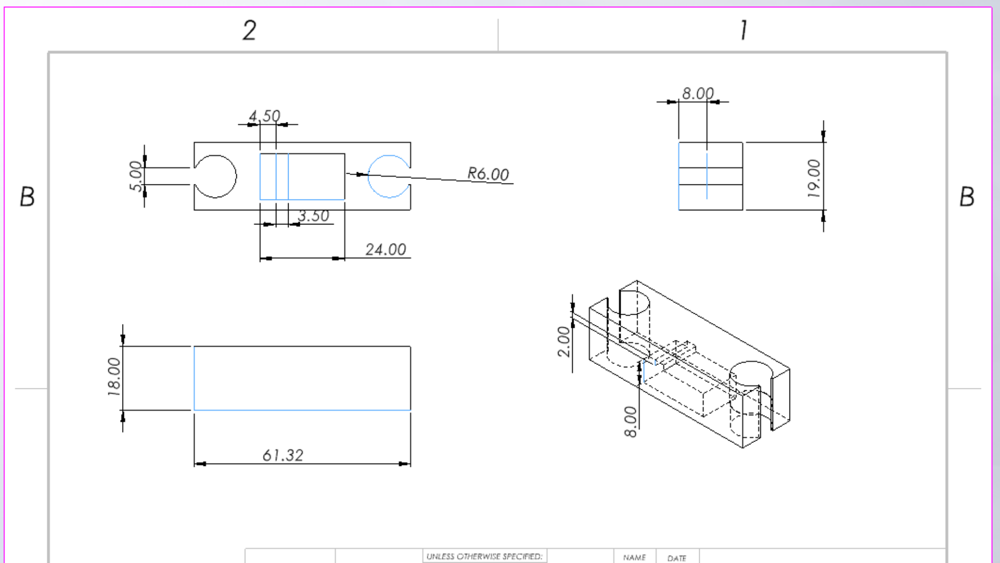

## Overview

<!-- Insert information about the goals of the project and what the project is. -->
Create a several segment clock to learn communication protocols, print statement debugging, and wire management in a physical project.

## Visuals

<!-- Insert Pictures of the project -->
Are not yet ready as the project is in the barest of implementation stages.

## Contribution

<!-- Talk about what parts I did for the project -->
I briefly saw an image of a similar project and wanted to attempt to create everything from scratch. This has thus far been limited by my lack of understanding of communication protocols and rather than risk breaking electrical parts, I enrolled in classes that would teach those communication protocols. Otherwise I have designed the initial layout of the physical components and the code base to match.

## Technical Details

<!-- Insert any technical information that would be desired -->
The current parts for the template are as follows:

* Clock segment or a servo mount
  * 
* Clock Face
  * 
* Corner link
  * 
* Center links
  * 

As for files to print these parts look no further than this [zip folder](ClockProject.zip)

| Item Name | Quantity | Price |
| :------------------ | :------------- | :------ |
| [Arduino Uno](https://www.amazon.com/s?k=arduino+uno&crid=3HS7LSJUDIEZV&sprefix=arduino+un%2Caps%2C242&ref=nb_sb_noss_2) | 1 | $27.60 |
| [SG90 Micro Servo Motor](https://www.amazon.com/10Pcs-Servos-Helicopter-Airplane-Controls/dp/B07MLR1498/ref=sr_1_2_sspa?crid=2P7G8ZSMZV0LR&dib=eyJ2IjoiMSJ9.DO_8huDXG-WCdEl_xxmMGHDTUq8Gy0sMBJu8P0uFAgVhzhgI-8Auign9UCI5rCaoxSxoYndJU5MYyev8C0a6ieWYdkzcgTzYfCfg0Cgzw-5ms2qD_ftnp_WAp6iGd6PH9KNRJEF3-4Nl5oe_stC43c_bBayX0liXO2K9QQAUbg2Dmh9al7SuJ6ZSTZh8fxflVRFM6yjkgBWzHdpXVPr-LDv9YqT8s8fDWtMQqxyiWLtozejDWtPCj6HElPdYyuiXUbApW2n6FGIv7D1uqR5DuTkAs2chwLgGHoaiO4OaNSA.u9U_zUnuJQdYyKSZm65shdvbQavOO6G2fdaWJDlAY2I&dib_tag=se&keywords=SG90%2BMicro%2BServo&qid=1767662914&s=toys-and-games&sprefix=sg90%2Bmicro%2Bservo%2Ctoys-and-games%2C180&sr=1-2-spons&sp_csd=d2lkZ2V0TmFtZT1zcF9hdGY&th=1) | 22 | $41.20 |
| [PCA9685 16 Channel PWM Servo Motor Driver Board](https://www.amazon.com/dp/B0DFTLMJCX?ref_=ppx_hzsearch_conn_dt_b_fed_asin_title_2) | 2 | $9.99 |
| 3D filament | Unknown | Unknown |

## Results

<!-- Did we meet project reqs, did we achieve initially goals? -->
This project is currently not complete so we have not achieved all of the goals of the project.
